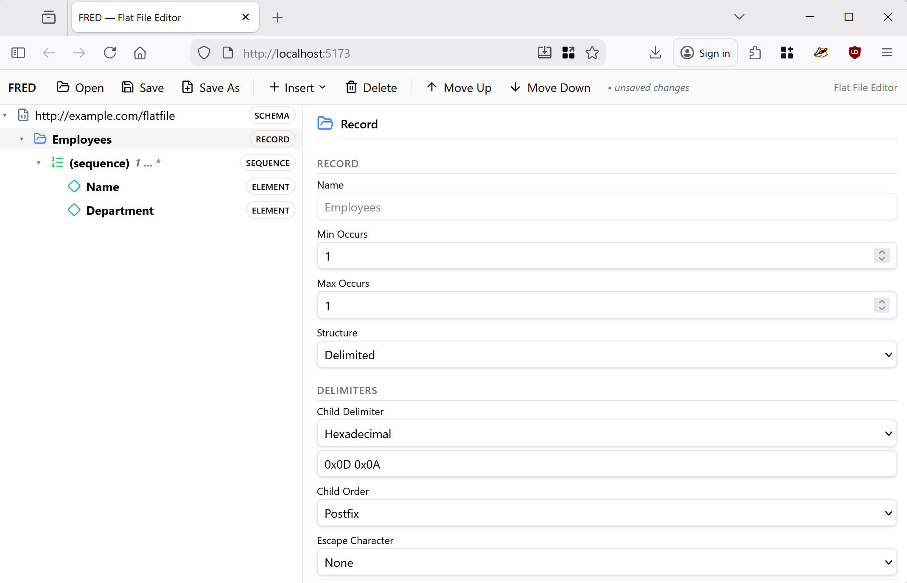

# Overview

FRED sends good vibes!

FRED is an editor for BizTalk Flat File XSD schemas.



## Running the app

```sh
pnpm install
pnpm dev
```

## Usage

FRED allows you to load, edit, and save XSD files annotated with Microsoft BizTalk Server flat-file extensions — the `b:schemaInfo`, `b:recordInfo`, `b:fieldInfo`, and `b:groupInfo` annotations that describe the physical layout of delimited or positional flat files.

### Opening and Saving Files

- **Open** — Click **Open** in the toolbar (or use the keyboard shortcut). On Chromium browsers, FRED uses the File System Access API to open `.xsd` files directly from disk. On other browsers, a classic file picker fallback is used.
- **Save** — Writes back to the original file handle (Chromium) or triggers a download.
- **Save As** — Prompts for a new file name and location.
- A sample schema is loaded automatically on first launch so you can explore the UI immediately.

### Tree View (Left Pane)

The schema structure is displayed as an interactive tree with color-coded icons for each node kind:

| Node Kind | Description |
|-----------|-------------|
| **Schema** | Root node — global defaults (delimiters, pad characters, code page, etc.) |
| **Record** | A complex-type element representing a delimited or positional structure |
| **Element** | A simple-type data field with its own field-level annotations |
| **Attribute** | An XSD attribute on a record |
| **Sequence** | An `xs:sequence` group with optional min/max occurrence constraints |
| **Choice** | An `xs:choice` group with optional min/max occurrence constraints |

- **Select** a node to view and edit its properties in the right pane.
- **Double-click** a named node (record, element, attribute) to **rename** it inline.
- **Right-click** any node for a context menu with insert, move, and delete options.
- **Min…max hints** are displayed next to sequence and choice nodes (e.g., `1…∞`).
- **Dirty indicators** — node labels turn **bold** when they have unsaved changes.

### Property Sheet (Right Pane)

Selecting a node displays an appropriate property panel with editable fields:

- **Text fields** — node name, namespace, delimiters, wrap/escape characters
- **Enum dropdowns** — structure type (delimited/positional), child order, justification, character type, etc.
- **Number fields** — max length, positions, offsets, tag offsets, code page, with increment/decrement
- **Boolean switches** — count positions in bytes, preserve delimiter for empty data, etc.
- **Special handling** — the `maxOccurs` field supports the `unbounded` keyword (set to `minOccurs - 1`); W3C built-in data types are available for element type selection

Changes are applied immediately to the in-memory schema tree and tracked at the per-property level.

### Inserting & Reordering Nodes

- **Insert child** — via the toolbar **Insert** dropdown or the context menu. Valid child kinds are enforced by the schema structure (e.g., you cannot add a sequence under an element).
- **Insert sibling** — via the context menu's **Insert After** submenu.
- **Move Up / Move Down** — reorder nodes among their siblings using the toolbar buttons or context menu.
- **Delete** — remove the selected node and its descendants.
- Newly inserted named nodes automatically enter inline rename mode.

### Resizable Layout

The split between the tree view and property sheet is **draggable** — grab the divider and resize to your preference.

## Has this been vibe coded?

Every line of code in this project was generated by an AI agent. Zero lines were typed by a human. Sounds like vibe coding, right? [Not even close.](vibes/VIBES.md)
